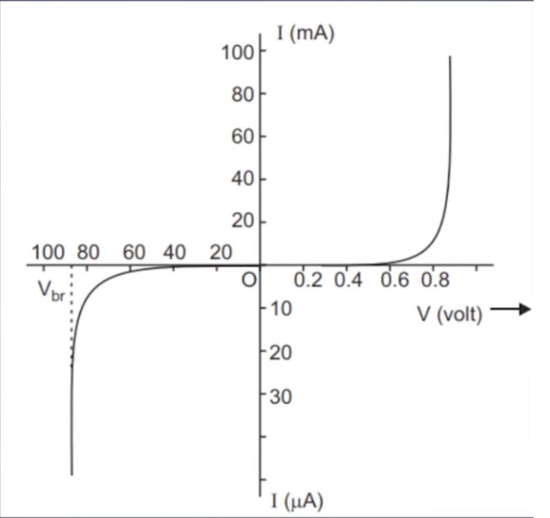
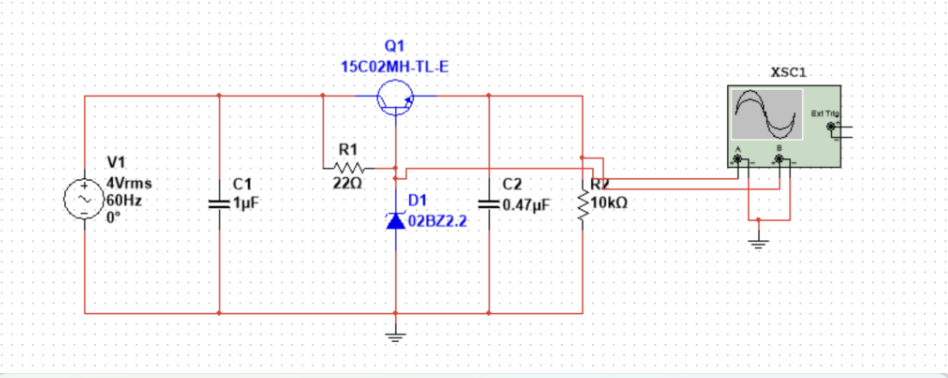
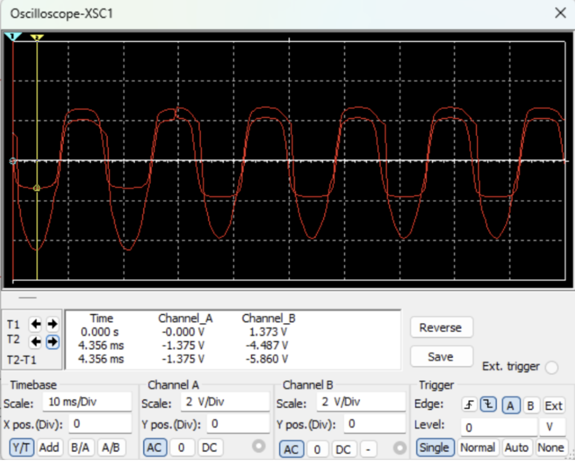
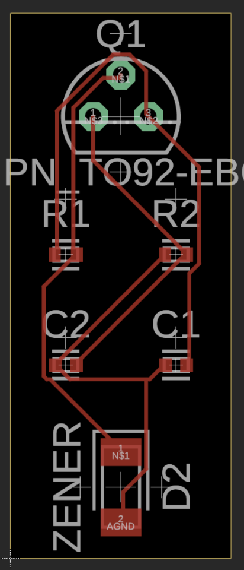
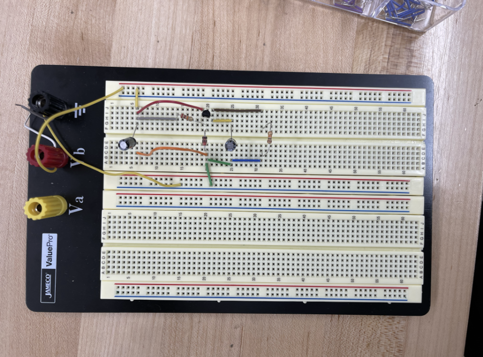
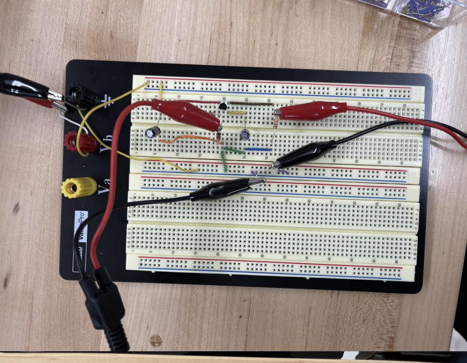
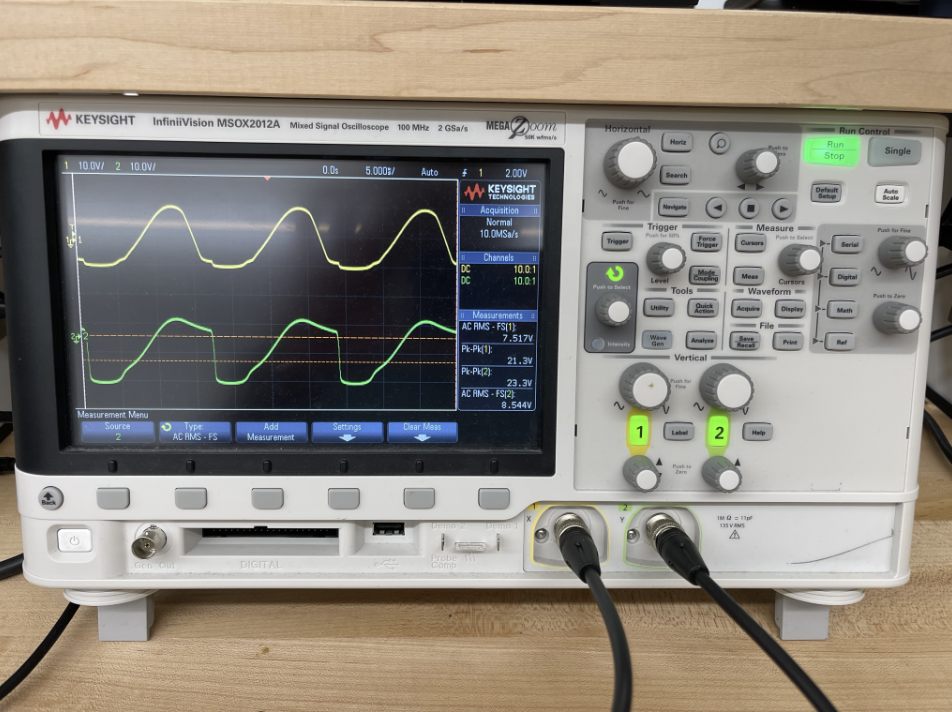

# BJT Voltage Regulator

## Zener Regulator

- Zener diode can be used in forward and reverse bias
  - Forward bias - works like a regular diode
  - Reverse bias - blocks current flow into it until the breakdown voltage is reached
- Breakdown voltage - once the voltage across the Zener increases past the threshold of the diode, it will allow current to flow through it

  

- Can be used with a resistor in series with it to act as a voltage regulator (not using a resistor will force a large amount of current, thus bypassing the breakdown voltage)
- Disadvantages
  - Very low efficiency for heavy load currents (not a problem in the micro mouse)
  - Poor load regulation; cannot handle changes in load current and voltage
  - Poor load regulation due to change in temperature
- Zener diode provides regulated voltage at the base of the transistor
  - This regulated voltage means that the voltage across the load should be the same as the voltage across the diode as both components are in parallel configuration
- Advantages
  - Cheap to construct
  - Easy customization
  - Good power handling

## BJT Voltage Regulator Simulation

- This simulation was done in Multisim and the voltage drop across the diode was not what I was expecting.
- Multisim said that the breakdown voltage was 3.3V but powering it with a 4V rms supply was still causing a greater negative voltage across the 10k resistor that acted as the load.
- For some reason Channel B has a lower negative voltage than positive and it exceeds the limit of the Zener which is set to 3.3V.

  

  

## PCB Layout

- This PCB layout was made in Fusion
- Q1 is the transistor. It is not the correct transistor since Fusion does not have a PCB layout for the one we have, but its layout should be similar.

  

## Breadboard Simulation

- This simulation was done with the Zener Diode I was given, which supposedly had a breakdown voltage of 3.3V, but this was seen to not be the case

  

## Breadboard Prototype

  

## Breadboard Measurement Set-Up

  

- The same issues from the Multisim arose with this simulation. Even though I tested the Zener before and determined it had a breakdown voltage of around 2.2V, the voltage over the 10k resistor still kept increasing up even after reaching 4 Vpp.
