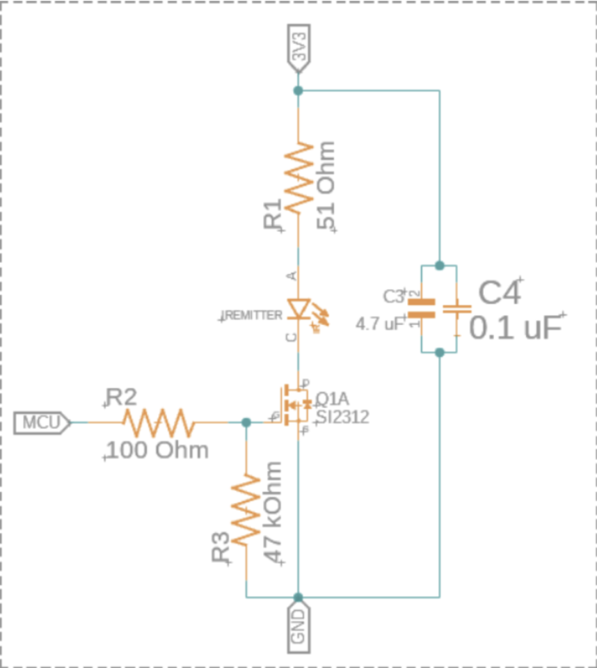
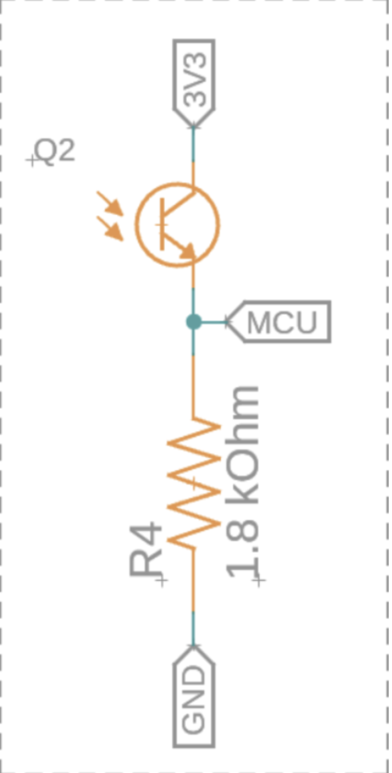
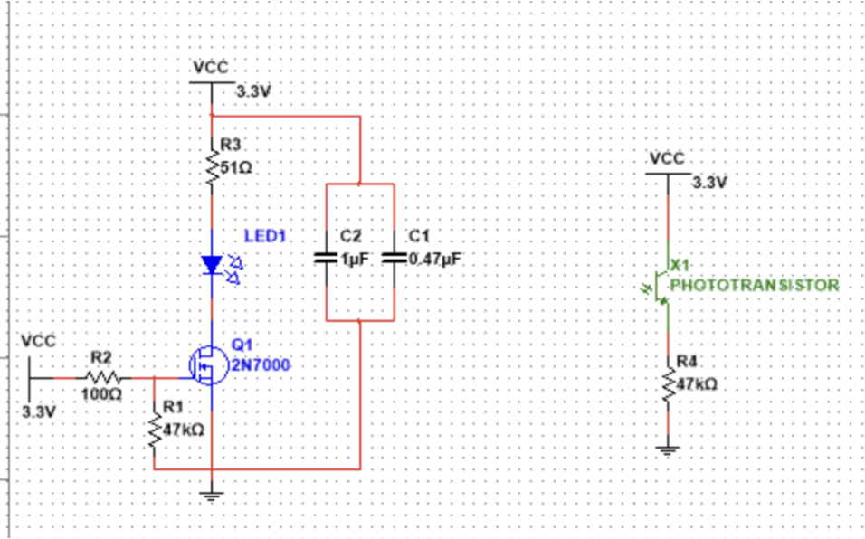
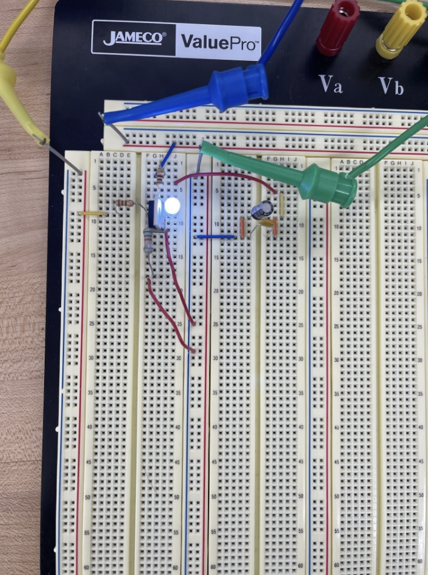
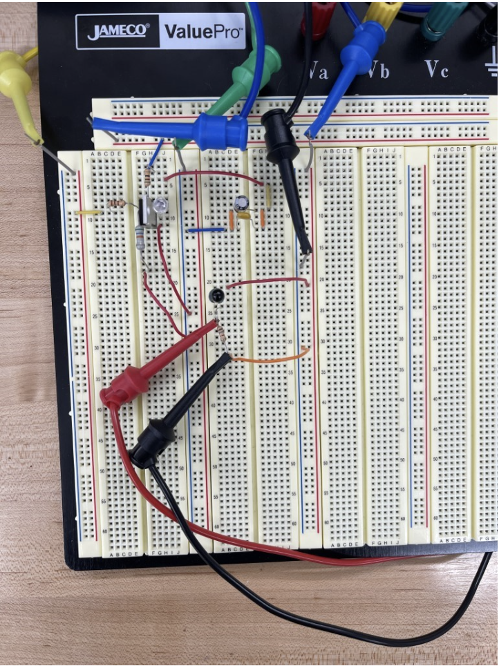
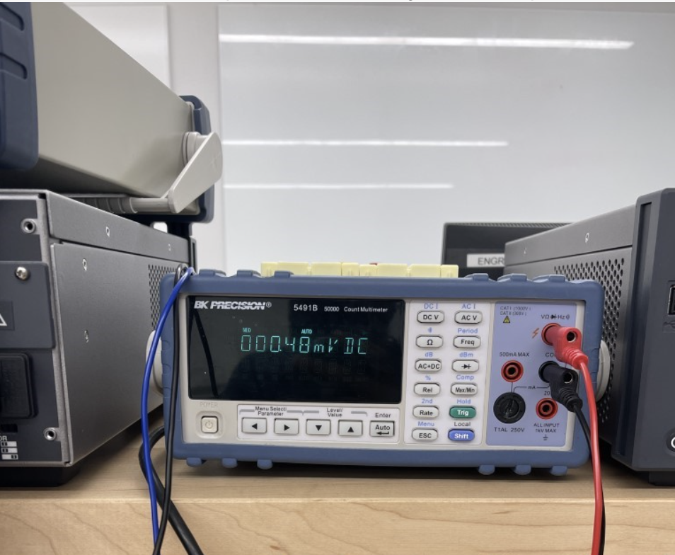
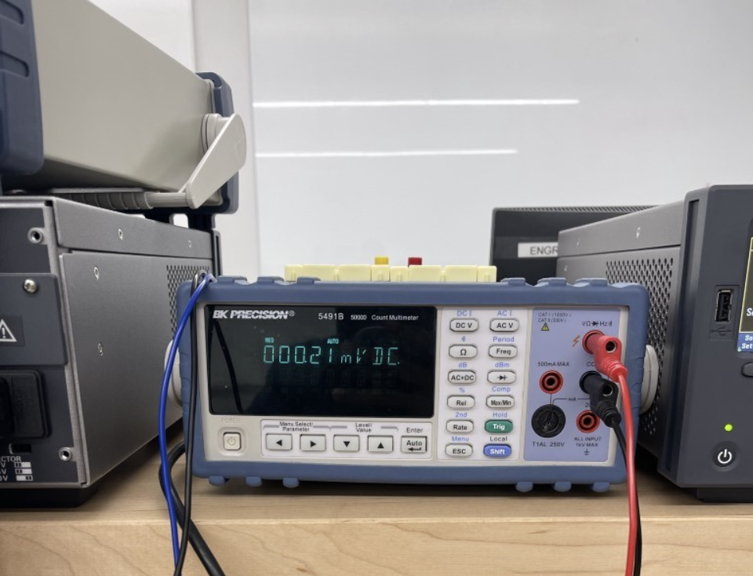
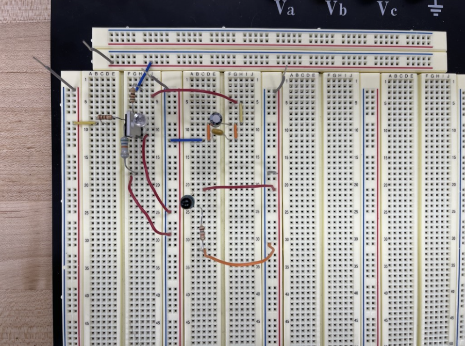

# IR Sensor

## How IR Sensors Work

- IR emitter - a specialized LED that emits infrared light
- IR receiver - a phototransistor that can detect infrared light
- When the IR emitter is turned on and off, the IR light it emits bounces off the surroundings into the phototransistor, which results in different values based on how far away the object is
- The closer the object the higher the number
- Higher number results in more voltage to the MCU

## Pros and Cons

### Pros

- Easy to implement
- No contact with wall needed
- Output analog value - allows for distance to be measured

### Cons

- Affected by ambient light
- Requires calibration
- Non-linear scaling of distances - intensity of light read by receiver is inversely proportional to the distance squared

## IR Emitter Circuit

The schematic of the IR Emitter is shown below:

  

- IR emitter can't be directly powered by an MCU pin due to the current requirement of the LED
  - Directly connected to 3.3V supply to counteract this
- Turned on and off through the use of a MOSFET connected to the MCU pin where the MCU sends a voltage to the MOSFET and this allows current to flow through the LED
  - N-channel MOSFET used (N-channel needs the gate voltage to be 5V to open)
- Bypass capacitors
  - Help to provide a clean signal when dealing with DC
- Resistors
  - R1 and R2 limit the current entering the LED and MOSFET
  - R3 is a pull-down resistor which means it is supposed to help the MOSFET stay off when the MCU is not sending a current signal; pulling the MOSFET to ground

## IR Receiver Circuit

The schematic of the IR receiver is shown below:

  

- If Q2 is reading more IR light, it lets a larger current pass through, resulting in a larger voltage drop across R4, which is what is measured by the MCU
- The closer the object, the greater the voltage drop, the further the object, the smaller the voltage drop. If no object is detected, no voltage drop and it acts like an open

## IR Sensor Multisim

- I could not get the simulation to actually run in Multisim, but that is okay because I got it to work on the breadboard

  

## IR Sensor Breadboard

- I assembled the breadboard for the IR receiver and IR emitter where they were both on the same board but isolated in terms of power and ground
- I first assembled the IR emitter and used an LED to better see if current was flowing through the diode as when I initially tried to make it yesterday, there was 0V over the resistor connected in series with the IR LED
- This LED version can be seen below:

  

  - This showed me that the IR emitter was working and now I had to develop the IR receiver

- When I first tried to make the IR receiver, I connected it to the same power and ground rail as the IR emitter, which caused the voltage over one of resistor connected in series with the IR LED to read 0V
- At the time I believed that I shorted the power supply but today I realized that was not the case and I just did not supply enough power to the gate of the MOSFET as I only supplied 5V
- The required voltage was 10V and I found it on the manufacturer's data sheet here: [Datasheet](https://www.jameco.com/Jameco/Products/ProdDS/209234FSC.pdf)

- Using both of these things I was able to make the IR receiver on the same breadboard as the IR emitter and this is shown below:

  

- Using this circuit setup, I moved my hand up and down above the IR LED and phototransistor and took pictures of the voltage at various points which are shown below:

  

  

- Here I have also included a video of me moving my hand while also recording the voltage change on the multimeter (this part is shown at the end, first it starts with me moving my hand, then showing the multimeter while moving my hand, and then showing both at the same time: [Test Video](IR_Sensor_Prototype.MOV)

- Here is an image of the board without any of the supply wires attached so you can better see the way the board was constructed:

  

